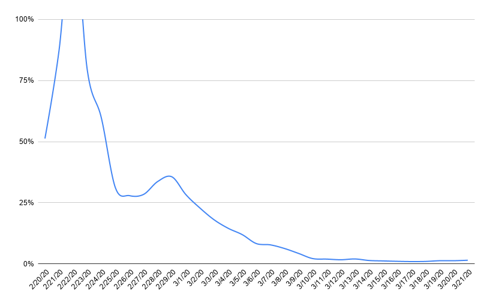
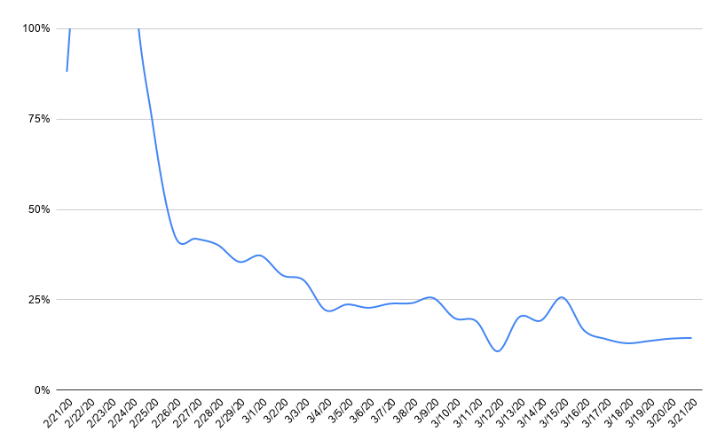
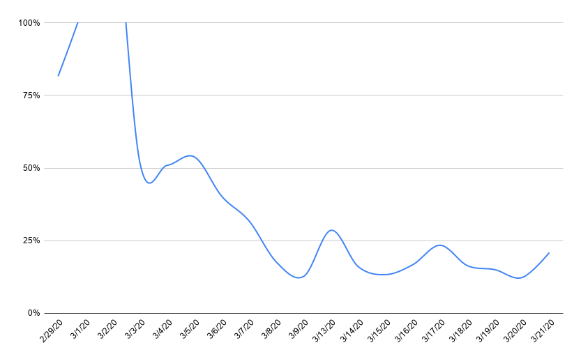
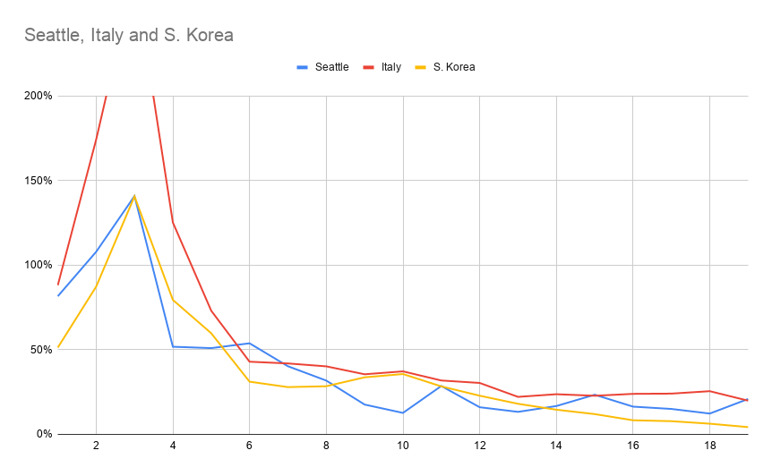
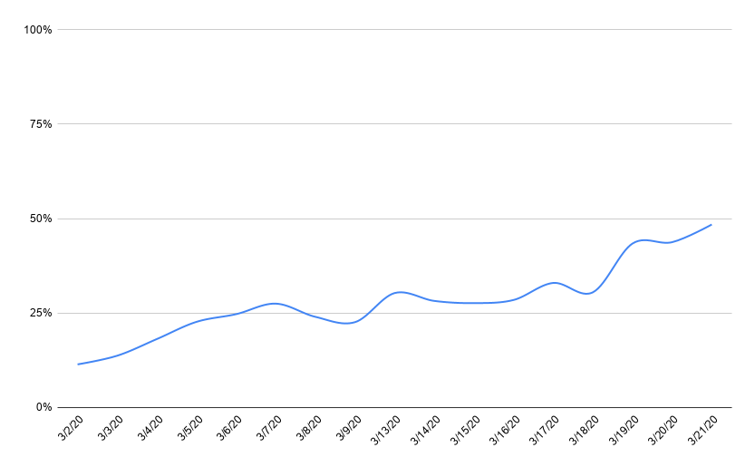

# Where are we really at?
*A few back of the envelope calculations*
 
It's too easy to panic watching the rapid growth of the Covid-19 virus. I did some back of the
envelope calculations to get a feel of exactly how bad our situation is, without making any 
predictions.

Things I'm ignoring here
- deaths - I'm focusing on what is going to overrun our hospitals here
- recoveries - negligible in the US right now
- early data in each outbreak - before it's moving within a community that early data doesn't 
really show a numerically valuable growth rate
 
### What data are we looking at?
 
Using the [publicly available Johns Hopkins data](https://github.com/CSSEGISandData/COVID-19) I took a 
look at the growth rate of confirmed cases. 

Basically the number of people confirmed infected today
divided by the number from yesterday, to get a percentage increase. To smooth the data I'm looking
at 3-day rolling average.

If you're checking my math this is calculated as

    |      today's confirmed         | ^ 1/3
    | -----------------------------  |
    | confirmed from 3-days previous |
 
 
 ### Where we want to be
South Korea is the model child for controlling covid-19, and this is what they're rate looked like.

What I notice:
- quickly drops to around 25% after the peak
- about a week later tails down toward zero
- continues to remain under 5%

### Where we don't want to be
We all know Italy is in trouble, this is what their rate looks like.

What I notice:
- moves toward the same 25% infection rate, but takes a lot longer to do it (nearly 2 weeks)
- does not tail off, instead it seems to hit a hard lower limit around 15%

### Where we are in Washington state
As for us up in Washington State, here's what our rate.

What I notice: 
- a stopoff at 50% but we get to under 25% within a week of the peak
- we seem to have a similar lower limit around 15% (though we have spent far less time there)  

### How do these compare
From my initial observations it seems like we are moving somewhere between Italy and South Korea.
If we overlay the data based on the peak infection rate we have this. 

Things I notice:
- we peak closer to South Korea than Italy
- our path doesn't quite track South Korea but it is clearly below Italy's path
- South Korea already had their growth rate under 5% by where we are today

So it looks like we're in better shape than Italy, but a bit off from South Korea. Could be worse,
could be better.

### Now for the bad news 
Here's the growth rate in the US.

Things I notice:
- we've not yet peaked

We're near a 50% growth rate and rising. That number has to turn around, and quickly or we're in 
trouble. It should as the nation starts taking it seriously.

If it doesn't turn around? We're at 25k infected as I write this, that rate translates to:
- 100k infected by Wednesday morning 
- 1 million by the following Monday, March 30